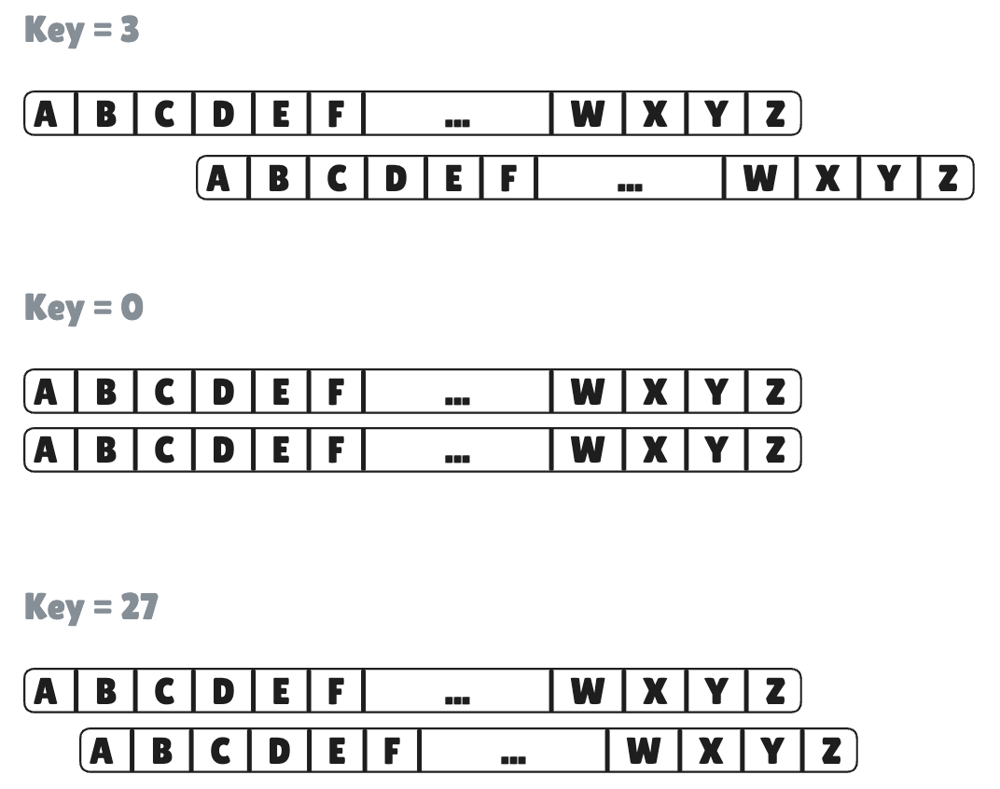

# Project 1 — Caesar Cipher

> **What you'll build**: A command-line program that encrypts and decrypts messages using the Caesar cipher.
>
> **Lessons**: 5 lessons + 1 final exercise.
>
> **Rust concepts covered**: variables, types, characters, arithmetic, functions, iteration, strings, control flow, pattern matching.

## What is the Caesar cipher?

The Caesar cipher is one of the oldest encryption techniques, named after Julius Caesar who used it in his military correspondence.

It works by shifting every letter in a message by a fixed number of positions in the alphabet. That fixed number is the **key**.

With a key of `3`:

```
A → D
B → E
C → F
...
X → A
Y → B
Z → C
```

So the message `Hello` becomes `Khoor`.



To decrypt, you shift back by the same amount: `Khoor` with key `3` → `Hello`.

Non-alphabetic characters (spaces, punctuation, digits) are left unchanged.

## What you'll build, lesson by lesson

Each lesson adds one layer to the program. By the final exercise you'll have a complete, working Caesar cipher with encrypt and decrypt.

| Lesson | What gets added |
|--------|-----------------|
| 1 — Print & Variables | Print the message and key |
| 2 — Characters & Arithmetic | Shift a single character |
| 3 — Functions | `shift_char` and `encrypt` as functions |
| 4 — Iteration & Strings | Loop over the full message |
| 5 — Control Flow & Edge Cases | Wrap-around, uppercase, decrypt |
| Final Exercise | End-to-end: encrypt then decrypt |

## How lessons work

Each lesson has two parts:

1. **Read** — this book. Work through the chapter before touching any code.
2. **Exercises** — small broken programs. Fix each one. Run `rbb watch caesar-XX` for instant feedback.
3. **Project step** — add the lesson's feature to the Caesar cipher program.

Start with the chapter. Then open the exercises. Then the project.
