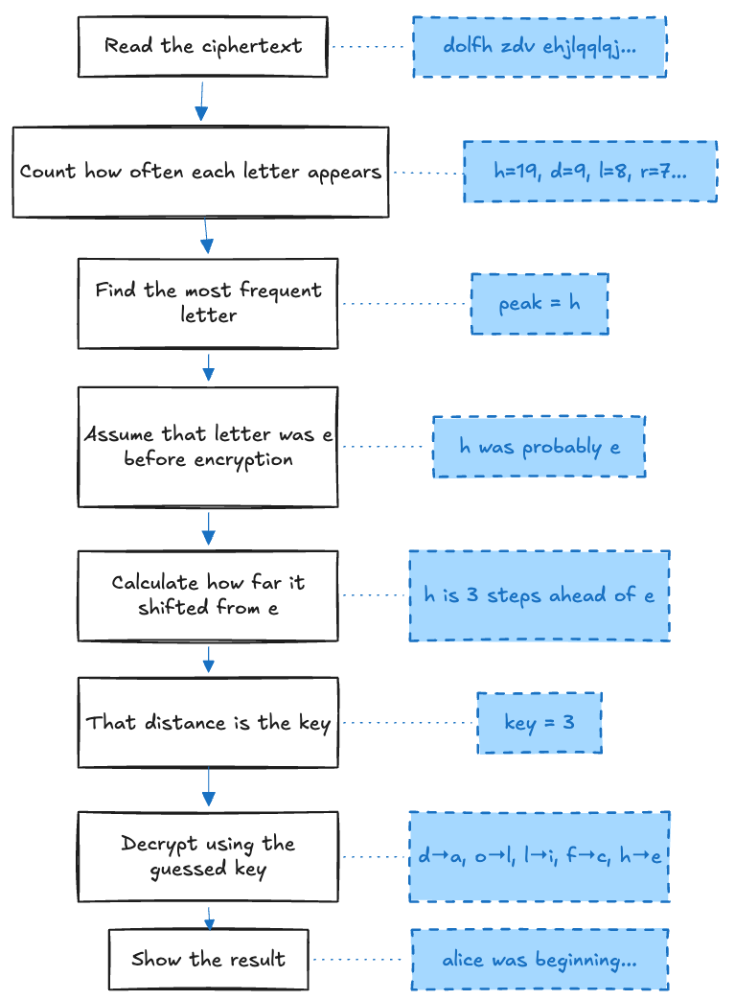

# Project 3 — Cipher Cracker

> **What you'll build**: A program that automatically cracks a Caesar cipher using letter frequency analysis — no key needed.
>
> **Lessons**: 6 lessons + 1 final exercise.
>
> **Rust concepts covered**: `HashMap`, traits, frequency analysis with `for` loops.

---

## What you'll build

Given a ciphertext, the program analyses which letters appear most often. In English, `'e'` is the most common letter. In the ciphertext, whatever letter is most common is probably the encrypted `'e'`. That tells you the key — and once you have the key, you can decrypt everything.

```
=== Cipher Cracker ===
Paste ciphertext (enter empty line when done):
dolfh zdv ehjlqqlqj wr jhw yhub wluhg...

Top 3 guesses:
  1. Key  3: alice was beginning to get very tired...  ← best
  2. Key 29: xebth wzv beceggbgc kf cek obho kbizy...
  3. Key 10: rogas nzm twceedce kf awk fwjm kbjwz...
```

This project reuses `decrypt` from project 1 — you'll feel the payoff of earlier work.



---

## What you'll build, lesson by lesson

| Lesson | What gets added |
|--------|-----------------|
| 1 — HashMap | Count each letter using `HashMap<char, u32>` |
| 2 — Traits | `Display`, custom traits, the `Iterator` trait explained |
| 3 — Iterators | Ranges, `.chars()`, `.count()`, `.enumerate()`, `.take()`, `.skip()` |
| 4 — Enums | `CrackResult` and `Command` enums, `match`, `if let` |
| 5 — Frequency Analysis | Find the peak letter, compute the key, return `CrackResult` |
| 6 — User Input | `Command` loop: crack or quit, top-3 guesses, preview |
| Final Exercise | Implement the full cracker from scratch |
